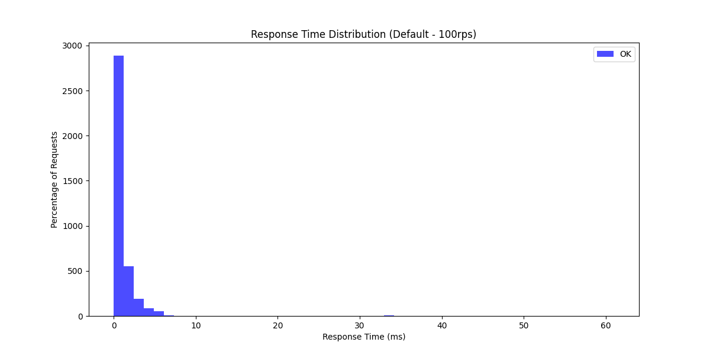
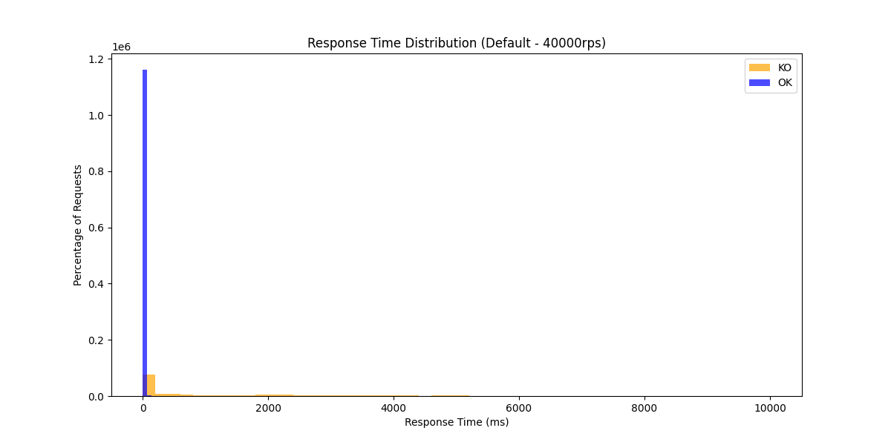
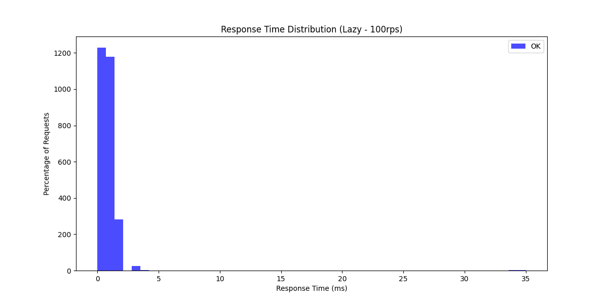

# Exam System Load Testing

This project implements a simple exam system for students and courses, with both optimistic and lazy approaches. It includes load testing scripts to evaluate the performance under different request per second (RPS) scenarios.

## Dependencies

- Java 8 or higher
- Apache Maven
- Docker
- Apache JMeter 5.6.1
- Python 3
- pandas
- matplotlib

## Build the Project

To build the project, use the following command:

```bash
mvn clean install
```

## Run Tests

The project includes web API tests. To run these tests, use:

```bash
mvn test
```

## Load Testing

To perform load testing and analyze the results, follow these steps:

1. Run the JMeter load tests using the provided script:

```bash
chmod +x jmeter/run_jmeter.sh
./jmeter/run_jmeter.sh
```

2. Analyze the results and generate plots:

```bash
pip install -r analysis/requirements.txt
python3 analysis/analyze_results.py
```

## Results

Here are the response time distribution plots for different RPS levels and implementations:

With a 10-second timeout, denial of service occurred at approximately the 40k RPS mark with around 4k records in the system.

### Default Implementation

- **1 RPS**:
  

- **100 RPS**:
  

- **40000 RPS**:
  

### Lazy Implementation

- **1 RPS**:
  

- **100 RPS**:
  

- **40000 RPS**:
  
